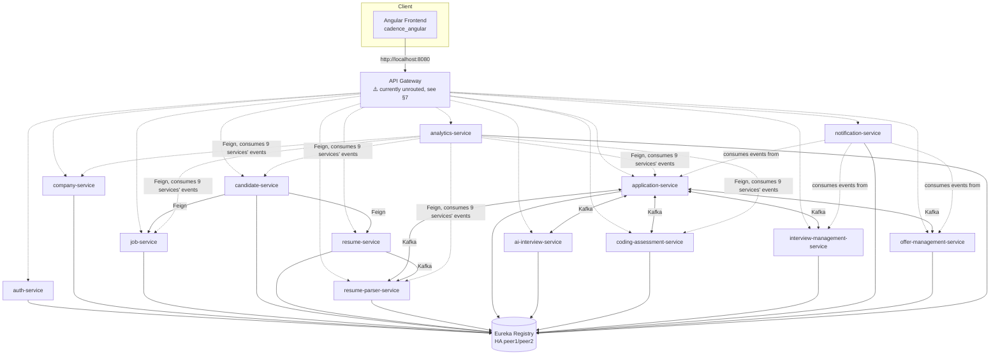

# Cadence — AI-Powered Recruiting Platform

**Developer handoff documentation**
Generated: 2026-07-22
Scope: all 15 backend microservices + API Gateway + Eureka registry (`E:\HIring_AI_Tool\*-service`, `eureka-server`) and the Angular frontend (`E:\HIring_AI_Tool\cadence_angular`).

> This document describes the system **as it exists in code today**, not as originally specced. Every "pending / not implemented" note below was confirmed by reading the actual source (controllers, config files, package contents), not inferred from a task list. Where a feature *looks* wired but isn't fully connected end-to-end, that's called out explicitly — this is the single most important thing for a new developer to understand before touching the codebase.

---

## 1. What Cadence Is

Cadence is a multi-tenant, AI-assisted recruiting/ATS (Applicant Tracking System) platform with two user-facing sides:

- **Recruiter/Company side** — company admins and recruiters post jobs, manage a hiring pipeline, review AI-parsed resumes and AI-generated match scores, run AI-driven candidate shortlisting and AI interviews, assign coding assessments, schedule human (technical/HR) interviews, generate and send offer letters, and view hiring analytics.
- **Candidate side** — candidates build a profile, upload resumes, browse and apply to jobs, take AI interviews and coding assessments, track application status, and (per the backend, though not yet the frontend — see §7) view interviews and offers.

The platform is built as a **microservices architecture**: 15 independently deployable Spring Boot services, each owning its own database, coordinated via Kafka events and Feign (synchronous REST) calls, registered in a Eureka service registry, and (intended to be, see §7) fronted by a single API Gateway. The frontend is a single Angular 18+ application using standalone components and Signals-based state management (no NgRx), talking to the platform exclusively through the Gateway's base URL.

---

## 2. High-Level Architecture

**Tech stack**: Java 17 / Spring Boot 3.x, Spring Cloud (Eureka, OpenFeign, Gateway), Kafka, Redis, MySQL/PostgreSQL (per-service), MinIO (resume file storage), Flyway migrations, MapStruct, Judge0 (code execution sandbox), free-tier LLM providers (Gemini / Groq / local Ollama) behind a Strategy-pattern abstraction. Frontend: Angular 18+, standalone components, RxJS, Signals for state (`AppStateService`), HttpClient + interceptors for JWT, lazy-loaded feature routes.

**Database-per-service**: every service owns its own schema exclusively (`auth_db`, `company_db`, `job_db`, `candidate_db`, `resume_db`, `resume_parser_db`, `application_db`, `ai_interview_db`, `coding_assessment_db`, `interview_management_db`, `notification_db`, `offer_management_db`, `analytics_db`). No service reads another's tables directly — all cross-service data access is via Feign calls or Kafka events.

---

## 3. Service-by-Service Reference

### 3.1 eureka-server

Single service registry every other service registers with and discovers each other through (via `lb://service-name` in Feign clients / Gateway routes).

- **HA**: real 2-node peer-aware cluster (`application-peer1.yml` / `application-peer2.yml`), each peer replicates to the other.
- Secured with HTTP Basic auth (default `eureka`/`eureka_pass` — change before real deployment).
- **Known gap**: each of the 13 pre-existing services' own `docker-compose.yml` still bundles an old placeholder `steeltoeoss/eureka-server` container from before this real registry was built. There is no single top-level compose file wiring everything to *this* registry — see §7.

### 3.2 api-gateway-service — ⚠️ scaffolding only, not functional

Intended to be the single entry point for the frontend (Spring Cloud Gateway, reactive/WebFlux) — routing, JWT validation, RBAC, rate limiting, circuit breaking, Swagger aggregation.

**Current state, confirmed by direct inspection of the source tree**: the entire `src/main/java` package contains **one file** — the bare `@SpringBootApplication` entry point. Every other package (`config/`, `controller/`, `dto/`, `exception/`, `filter/`, `resilience/`, `security/`) exists as an empty directory. Concretely:

| Planned capability | Status |
|---|---|
| Route configuration (13 routes) | **Not implemented** — `application.yml` has no `spring.cloud.gateway.routes` block; `discovery.locator.enabled: false` |
| JWT validation filter | **Not implemented** — no filter class exists |
| Role-based route authorization | **Not implemented** |
| Rate limiting (Redis) | **Not implemented** — dependency present, no filter wired |
| Circuit breaker / retry / fallback | **Not implemented** — no Resilience4j dependency at all |
| CORS config | Not implemented |
| Swagger aggregation | Not implemented |

**This is the single biggest gap in the platform.** The frontend is built to call everything through `http://localhost:8080/{prefix}/api/v1/...`, but as of today nothing is listening on 8080 to route those calls anywhere — every service must currently be hit directly on its own port for manual testing.

### 3.3 auth-service

Owns registration, login, JWT issuance/refresh, MFA, RBAC, password lifecycle, sessions, and audit logging, for every user type.

- **User types**: `ADMIN`, `COMPANY_ADMIN`, `RECRUITER`, `CANDIDATE`.
- **Roles** (DB-backed): `ROLE_ADMIN`, `ROLE_COMPANY_ADMIN`, `ROLE_HR_MANAGER`, `ROLE_HR_RECRUITER`, `ROLE_TECHNICAL_RECRUITER`, `ROLE_TALENT_ACQUISITION_MANAGER`, `ROLE_HIRING_MANAGER`, `ROLE_CANDIDATE`.
- **JWT**: HS256, 15-minute access token; claims = `sub` (userId), `email`, `roles[]`, `permissions[]`, `companyId` (nullable for candidates). Refresh tokens are opaque, SHA-256-hashed at rest, rotated on every use with theft-detection chaining.

| Method | Path | Purpose |
|---|---|---|
| POST | `/api/v1/auth/register` | Register candidate / recruiter / company admin |
| POST | `/api/v1/auth/login` | Login → tokens, or `mfaRequired: true` |
| POST | `/api/v1/auth/mfa/verify-login` | Complete MFA-gated login |
| POST | `/api/v1/auth/refresh-token` | Rotate access/refresh pair |
| POST | `/api/v1/auth/logout` | Revoke session(s) |
| POST | `/api/v1/auth/forgot-password`, `/reset-password` | Emailed reset flow |
| GET | `/api/v1/auth/verify-email`, POST `/resend-verification` | Email verification |
| GET | `/api/v1/auth/me` | Current profile |
| POST | `/api/v1/auth/mfa/setup`, `/confirm`, `/disable` | TOTP MFA enrollment |
| GET/DELETE | `/api/v1/auth/sessions[/{id}]` | Device session management |
| GET/POST | `/api/v1/auth/roles`, `/roles/{userId}/assign|revoke` | RBAC admin |
| GET | `/oauth2/authorization/google` | Google social login |

**Entities**: `users`, `roles`, `permissions`, `role_permissions`, `user_roles`, `refresh_tokens`, `password_reset_tokens`, `email_verification_tokens`, `mfa_secrets`, `user_sessions`, `audit_logs`.
**Kafka published**: `auth.user.registered`, `auth.user.logged-in`, `auth.password.reset-requested/.changed`, `auth.account.locked`.

**Pending / flagged in code**: no WebAuthn/passkeys; no adaptive/risk-based auth; no rate limiting on `/login` or `/forgot-password` (Redis is present but unused for this); shared HS256 secret across services rather than RS256 + per-service key rotation; signing key lives in config, not KMS/Vault.

### 3.4 company-service

Owns company profile, departments, offices, team invitations only.

| Method | Path | Purpose |
|---|---|---|
| CRUD | `/api/v1/companies[/{id}]` | Company profile |
| CRUD | `/api/v1/companies/{companyId}/departments`, `/api/v1/departments/{id}` | Departments |
| CRUD | `/api/v1/companies/{companyId}/offices`, `/api/v1/offices/{id}` | Offices (one primary enforced) |
| CRUD | `/api/v1/companies/{companyId}/team-invitations`, `/api/v1/team-invitations/{id}` | Invitations |
| POST | `/api/v1/team-invitations/{token}/resend` | Resend invite |

**Entities**: `companies`, `departments`, `offices`, `team_invitations`.
**Kafka published**: `company.company.created/.updated`, `company.department.*`, `company.office.*`, `company.team-invitation.created/.cancelled`.
**Kafka consumed**: `auth.user.created`, `auth.invitation.accepted`.

**Pending / flagged**: `X-User-Id` header is currently a **trusted, unauthenticated** header — safe only behind a Gateway that strips/re-injects it after JWT validation (which doesn't exist yet, see §3.2). Department-name uniqueness is service-layer only (race condition possible under concurrency).

### 3.5 job-service

Owns the full job-posting lifecycle and per-job pipeline configuration.

| Method | Path | Purpose |
|---|---|---|
| POST | `/api/v1/jobs` | Create draft (step 1 of wizard) |
| PUT | `/{id}/basic-info`, `/requirements`, `/pipeline-stages` | Wizard steps 2-4 |
| POST | `/{id}/publish`, `/pause`, `/resume`, `/close`, `/archive`, `/restore`, `/duplicate` | Lifecycle transitions |
| DELETE | `/{id}` | Delete draft only |
| PUT | `/{id}/assignment` | Assign recruiter/hiring manager |
| GET | `/jobs?...` | 8-filter search |
| GET | `/jobs/counts`, `/jobs/dashboard` | Aggregates |
| CRUD | `/api/v1/job-templates` | Reusable templates |

**Entities**: `jobs` + `job_description`, `job_requirements`, `job_skills`, `job_benefits`, `job_pipeline_stage`, `job_assignment`, `job_status_history`, `job_audit`, `job_template`.
**Kafka published**: `job.job.created/updated/published/closed/archived/restored/deleted`.

**Pending / flagged**: an hourly scheduled sweep (not request-time) drives PUBLISHED/PAUSED → EXPIRED. Company scoping is derived server-side from the JWT only; cross-company access always 404s (existence never leaked as 403). `AuthServiceClient.getUserById` is an unused stub — no matching endpoint exists yet on auth-service.

### 3.6 candidate-service

Owns the candidate's self-service world: profile wizard, applications, saved jobs, dashboard.

| Method | Path | Purpose |
|---|---|---|
| GET | `/api/v1/candidates/me` | Full profile |
| PUT | `/me/basic-info`, `/education`, `/experience`, `/skills`, `/projects`, `/certifications`, `/languages`, `/job-preferences`, `/portfolio` | 10-step wizard |
| POST | `/me/resume` | Resume upload (multipart) |
| POST | `/api/v1/applications` | Apply to a job |
| GET | `/applications?filter=`, `/{id}` | List / detail |
| POST | `/{id}/withdraw` | Withdraw |
| POST | `/{id}/stage` | Stage transition (recruiting roles) |
| POST/DELETE/GET | `/api/v1/saved-jobs` | Saved jobs |
| GET | `/api/v1/dashboard` | Candidate dashboard aggregate |

**Entities**: `candidates` (primary key **is** the Auth-issued userId), `candidate_education/experience/projects/certifications/skills/languages/job_preferences/portfolio_links`, `saved_jobs`, `applications` (own local copy — see application-service for the authoritative one, §3.9), `application_status_history`.
**Kafka published**: `candidate.profile.created/updated`, `candidate.resume.uploaded`, `candidate.application.submitted/withdrawn/stage-changed`, `candidate.job.saved/unsaved` (currently consumed by nothing — forward-scaffolded).

**Pending / flagged**: no Kafka consumer creates the candidate row on registration — the wizard's first step does upsert-on-first-call instead. Resume storage is local disk pending an S3/GCS swap. Schema already has `resumeParsedAt`/`aiResumeScore` columns that nothing populates (that data actually lives in resume-parser-service now — a duplication worth resolving).

### 3.7 resume-service

Owns resume file storage/retrieval/metadata only (MinIO-backed). No parsing or scoring.

| Method | Path | Purpose |
|---|---|---|
| POST | `/api/v1/resumes/upload` | Upload |
| GET | `/resumes`, `/{id}`, `/{id}/download`, `/{id}/preview` | Candidate access |
| PUT | `/{id}/default`, `/{id}/rename` | Manage |
| DELETE | `/{id}` | Soft delete |
| GET | `/api/v1/internal/resumes/{id}/download`, `/preview`, `/{id}`, `/{id}/object` | Recruiter/internal, trusted callers |

**Entities**: single `resumes` table (status ACTIVE/DELETED/ARCHIVED).
**Kafka published**: `resume.resume.uploaded/.deleted`, `resume.default.changed`.

**Pending / flagged**: max 3 active resumes/candidate; PDF-only, validated by magic bytes not extension; soft-delete never erases the MinIO object (no GDPR-erasure policy implemented yet).

### 3.8 resume-parser-service

Two merged capabilities: LLM-based resume field extraction, and AI resume↔job match scoring. One DB, free-tier LLMs (Gemini/Groq/Ollama) via a Strategy abstraction shared with ai-interview-service and coding-assessment-service.

| Area | Key endpoints |
|---|---|
| Parsing (recruiter) | `GET /api/v1/parser/queue[/summary]`, `GET /parser/resumes/{id}[/skills\|/experience\|/education\|/projects\|/certifications\|/status\|/logs]`, `POST /parser/resumes/{id}/retry` |
| Matching (recruiter) | `GET /api/v1/resume-analysis/jobs/{jobId}[/summary]`, `/top/{jobId}`, `/recommendations`, `/applications/{applicationId}`, `POST /recalculate/{applicationId}` |
| Internal | `GET /api/v1/internal/parser/resumes/{id}`, `/api/v1/internal/resume-analysis/{applicationId}` |

**Kafka published**: `resume-parser.resume.parsed/.parsing-failed/.analyzed/.analysis-failed`.
**Kafka consumed**: `resume.resume.uploaded`, `candidate.profile.deleted`, `application.application.created`.

**Pending / flagged — real cross-service bug**: `ApplicationCreatedEvent.resumeId` is **null at publish time** because application-service's event builder never sets it, so every match starts stuck at `AWAITING_RESUME` until someone calls the manual `POST /recalculate/{applicationId}` workaround. **The actual fix is a one-line change in application-service's event publisher, not yet made.** `ResumeAnalyzed`/`ResumeAnalysisFailed` events currently have no consumer.

### 3.9 application-service

The hiring-workflow core: owns the Application aggregate (20-status / 10-stage state machine), full audit trail, recruiter notes. Coordinates around every other service.

| Area | Key endpoints |
|---|---|
| Candidate | `POST /api/v1/applications` (apply), `GET /applications/my`, `GET/{id}`, `DELETE/{id}` (withdraw), `POST /{id}/accept-offer`, `/reject-offer` |
| Recruiter | `GET /applications/company/{companyId}` (search/filter), `GET /applications/job/{jobId}`, `PUT /{id}/status`, `/assign-recruiter`, `/assign-hiring-manager`, `POST /{id}/notes` |
| Shared | `GET /{id}/timeline`, `/history` |
| Internal | `PUT /internal/application/{id}/resume-score`, `/interview-score`, `/coding-score`, `/overall-score` |

**Entities**: `applications` (aggregate root), `application_status_history`, `application_stage_history`, `application_scores`, `application_notes`, `application_events`.
**Kafka published**: `application.application.created/withdrawn`, `application.status.changed`, `application.recruiter.assigned`, `application.hiring-manager.assigned`, `application.offer.accepted/rejected`.
**Kafka consumed** (7 topics, several from producers that don't fully exist yet — see below): `resume.resume.parsed`, `matching.resume.matched`, `shortlisting.candidate.shortlisted`, `interview.interview.completed`, `assessment.coding.completed`, `verification.background.completed`, `offer.offer.released`.

**Pending / flagged — the platform's biggest cross-cutting risk**: this service assumes every downstream stage (matching, shortlisting, interview, coding, background verification, offer) will eventually publish the exact topic it's already listening for. Until every producer is fully wired end-to-end, an application can sit stuck at a stage indefinitely in a real run. The 4 internal score-update endpoints are the documented manual workaround. Also: **department/location/experience search filters are explicitly not implemented** (cross-service join gap, `ApplicationSpecifications`). No "advance application stage" endpoint exists on the internal controller either — this is why ai-interview-service and coding-assessment-service (below) can't fully close the loop on their own recommendations.

### 3.10 ai-interview-service

AI Shortlisting → AI Interview (chat/voice/video) → AI Evaluation. Same LLM-provider Strategy pattern.

| Area | Key endpoints |
|---|---|
| Shortlisting (recruiter) | `GET /api/v1/ai-interviews/shortlisted\|rejected\|manual-review/{jobId}`, `/shortlisting/summary/{jobId}`, `/ranking/{jobId}`, `POST /{applicationId}/shortlist`, `/reject-manual`, bulk actions |
| Interviews (recruiter) | `GET /queue/{jobId}`, `/analysis-summary/{jobId}`, `/completed/{jobId}`, `POST /{applicationId}/start`, `/send-reminder`, `/resend-invite`, `GET /{applicationId}/report`, `POST /move-to-coding`, `/reject`, `/manual-review` |
| Candidate | `GET /api/v1/candidate/interview/details`, `POST /start`, `/answer`, `/finish`, `GET /result` |

**Kafka published**: `ai-interview.candidate.shortlisted/.interview.started/.completed/.evaluated/.candidate.recommended`.
**Kafka consumed**: `resume-parser.resume.analyzed`.

**Pending / flagged**: no "advance stage" endpoint on application-service (§3.9) means this service's evaluation/recommendation events can't directly drive the application's official state — recruiter "Move to Coding"/"Reject" only updates this service's own local recommendation record today. No notification-service integration wired here — `sendReminder`/`resendInvite` only validate and log, no email is actually sent (see §3.13 for the separate, working notification pipeline that exists but isn't cross-wired to this).

### 3.11 coding-assessment-service

Full coding-assessment lifecycle: question bank, invitations, online IDE, sandboxed execution, AI code review, scoring, analytics.

| Area | Key endpoints |
|---|---|
| Recruiter | CRUD `/api/v1/assessments[/{id}]`, `/publish`, `/clone`, `/archive`, `/close`, `PUT /{id}/questions`, `GET /{id}/details`, `/queue`, `POST /{id}/send-reminders`; CRUD `/api/v1/questions`; `GET /results/summary`, `/leaderboard/{assessmentId}`, `/submissions/{assessmentId}[/{applicationId}]`, `/analytics/{assessmentId}` |
| Candidate | `GET /api/v1/candidate/assessments[/{id}]`, `POST /accept-rules`, `/start`, `GET /questions/{questionIndex}`, `POST /run`, `/submit`, `/{id}/finish`, `/mark-for-review`, `/anti-cheat-events`, `GET /candidate/result/{id}` |

**Kafka published**: `assessment.coding.completed` (consumed by application-service).
**Kafka consumed**: `ai-interview.candidate.recommended`.

**Pending / flagged**:
- Uses **Judge0** for real sandboxed code execution — Judge0 itself is **not bundled** in this service's docker-compose (needs privileged cgroup access; must be provisioned separately, self-hosted or via RapidAPI).
- **No plagiarism-detection engine exists.** The `plagiarismDetection` toggle and result badge are real UI/API surface, but the badge is a static `"No plagiarism detected"` placeholder — explicitly flagged in code rather than silently faked as working.
- `assessment_eligibility` is tracked locally only because application-service can't consume `CandidateRecommended` directly (same gap as §3.9/§3.10).
- No notification-service wiring — reminders log only, don't send.

### 3.12 interview-management-service

Human interview scheduling (Technical/Manager/Architect/HR/Custom rounds) — distinct from ai-interview-service, which owns AI interviews exclusively.

| Area | Key endpoints |
|---|---|
| Recruiter | `POST /api/v1/recruiter/interviews` (schedule), `PUT /{id}/reschedule`, `/cancel`, `GET /api/v1/recruiter/interviews[?status=]`, `GET /{id}`, `/{id}/activity`, `POST /{id}/feedback`, `GET /{id}/feedback`, `POST /{id}/decision` (Move to HR/Next round/Select/Reject/Hold/Request another interview), `GET /timeline/{applicationId}` |
| Interview rounds | CRUD `/api/v1/recruiter/interview-rounds` (per-company round-type config) |
| Candidate | `GET /api/v1/candidate/interviews[?upcomingOnly]`, `/{id}`, `POST /{id}/request-reschedule`, `GET /interviews/timeline/{applicationId}` |

**Entities**: `interview_round`, `interview`, `interview_panelist`, `interview_feedback`, `candidate_timeline`, `interview_activity_log`.
**Kafka consumed**: `CandidateRecommended`, `AssessmentCompleted`. **Kafka published**: own scheduling events + bridges application-service's `InterviewCompletedEvent`.

**Pending / flagged (frontend)**: **no candidate-facing "My Interviews" screen exists in the Angular app**, despite this service's `CandidateInterviewController` being fully built (route `/candidate/interviews` doesn't exist — only `/recruiter/interviews` does). The recruiter's "Interview panel" picker also has no real interviewer-directory endpoint anywhere on the platform, so panel assignment defaults to the scheduling recruiter themselves.

### 3.13 notification-service

Personal in-app notifications + transactional/templated email (Thymeleaf rendering, JavaMailSender), admin template management, delivery queue/history/retry.

| Area | Key endpoints |
|---|---|
| Personal notifications | `GET /api/v1/notifications[?status]`, `/{id}`, `PUT /{id}/read`, `/read-all`, `/{id}/archive`, `DELETE /{id}`, `GET /unread-count`, `/history`, `GET/PUT /preferences` |
| Templates (admin) | CRUD `/api/v1/templates`, `GET /{id}/preview` |
| Email queue | `GET /api/v1/email-queue[?status]`, `/{id}`, `POST /retry/{id}`, `/retry-bulk`, `DELETE /{id}` (cancel scheduled), `GET /stats` |
| Email history | `GET /api/v1/email-history[?recipient][?status]` |
| Logs | `GET /api/v1/notification-logs[?source]` |

**Kafka consumed**: events from company-service, application-service, interview-management-service, offer-management-service, and others (DLQ-backed consumers with exponential-backoff retry worker).

**Pending / flagged (frontend)**: fully wired to real data on both recruiter and candidate sides as of this integration pass. One structural gap: `EmailQueueItemResponse` has no "reason" field for scheduled (not-yet-sent) emails, only for failed ones; and there's no "send now" endpoint for a pending scheduled email (only retry-a-failed-one exists).

### 3.14 offer-management-service — ⚠️ no frontend at all

Offer creation (4-step wizard: role/compensation → benefits/approver → review → send-mode), approval workflow, PDF letter generation (OpenPDF), candidate accept/decline/negotiate.

| Area | Key endpoints |
|---|---|
| Recruiter | `POST /api/v1/offers` (create + apply send-mode), `PUT /{id}`, `DELETE /{id}` (draft only), `GET /offers[?status]`, `/{id}`, `POST /{id}/generate`, `/preview`, `GET /{id}/document`, `POST /{id}/approve`, `/send`, `/withdraw`, `GET /history`, `/pending`, `/accepted`, `/rejected`, `/stats` |
| Candidate | `GET /api/v1/candidate/offers`, `/{offerId}`, `GET /{offerId}/download`, `POST /{offerId}/accept`, `/reject`, `/request-negotiation` |

**Kafka published/consumed**: offer lifecycle events; an `OfferExpiryScheduler` sweeps expired offers.

**Pending / flagged — biggest frontend gap found in this integration pass**: **no recruiter Offer Management screen and no candidate "My Offer" section exist anywhere in the Angular app**, despite this service being fully built end-to-end (approval workflow, PDF generation, negotiation). The existing "accept/reject offer" buttons on the candidate Applications screen belong to a *different, simpler* concept — application-service's own `OFFER_RELEASED/ACCEPTED/DECLINED` pipeline-stage transitions (§3.9) — not this richer, dedicated offer entity (compensation breakdown, approval chain, PDF letters, salary negotiation). Building the missing screens is new frontend work requiring explicit design/product sign-off; only the API-wrapper layer (model + service classes) was built ahead of time on the Angular side.

### 3.15 analytics-service

Cross-service aggregation: role-scoped dashboards, domain analytics, hiring funnel, recruiter performance table, daily/monthly/yearly reports with CSV/Excel/PDF export.

| Area | Key endpoints |
|---|---|
| Dashboards | `GET /api/v1/dashboard/executive` (ADMIN only, platform-wide), `/company`, `/recruiter`, `/hr`, `/hiring-manager` (all company-scoped) |
| Domain analytics | `GET /api/v1/analytics/jobs`, `/candidates` (company-scoped), `/resumes`, `/interviews`, `/assessments`, `/offers` (platform-wide — these source events never carry a companyId) |
| Funnel | `GET /api/v1/funnel` (company-scoped hiring funnel) |
| Recruiter performance | `GET /api/v1/recruiter-performance` |
| Reports | `GET /api/v1/reports/daily`, `/monthly`, `/yearly`, `/export/csv`, `/export/excel`, `/export/pdf` |

**Kafka consumed**: events from 9 source services (company, job, candidate, application, resume-parser, coding-assessment, and others) into a `MetricIngestionService` aggregation engine.

**Pending / flagged (confirmed in code, not fabricated)**:
- `diversityRatioPercent` is **always null** — no gender/diversity field exists on any event anywhere in the platform.
- Offer analytics is missing `avgSalary`/department/location breakdowns — no event from offer-management-service carries CTC/department/location, and there's no Feign client to that service either.
- Excel export produces legacy `.xls` (HSSFWorkbook), not `.xlsx` — `poi-ooxml` isn't available in the offline build environment.
- The hiring funnel has **no per-job filter** — it's company-wide only.
- No "skill demand" analytics exists anywhere (the frontend's Analytics screen originally showed a fabricated skill-demand widget; it's now been repointed to the real source-breakdown data instead — see §6).

---

## 4. Frontend (Angular) Architecture

- **Standalone components**, lazy-loaded per route, no NgModules.
- **State management**: a single injectable `AppStateService` (Signals-based) is the *only* thing components talk to — no component ever injects a domain HTTP service directly. Each backend module gets its own signals + methods added directly onto this one service.
- **HTTP**: one `HttpClient`-based service per backend module (e.g. `JobService`, `ApplicationService`, `InterviewManagementService`), all pointed at `{environment.apiBaseUrl}/{service-prefix}/api/v1/...` where `apiBaseUrl` is the Gateway's base URL (`http://localhost:8080`) and `{service-prefix}` is the Eureka app name with its `-service` suffix stripped (e.g. `interview-management-service` → `/interview-management`).
- **Auth**: JWT stored in `localStorage` (access + refresh token + user object), an HTTP interceptor attaches the access token and handles silent refresh, route guards (`authGuard`, `recruiterGuard`, `candidateGuard`) gate `/recruiter/**` vs `/candidate/**` based on the JWT's `userType` claim.
- **Reactive forms** where the codebase already used them; elsewhere template-ref-variable + manual validation (an established, deliberate pattern, not an oversight).
- **Tables/lists**: pagination/sorting/filtering wired to backend `PagedResponse<T>` wherever the screen supports it; **no chart is hardcoded** — every chart/KPI binds to a real backend signal, with an explicit empty-state (not a fabricated number) wherever the backend genuinely has no data for that field.

### Angular ↔ backend module map

| # | Module | Frontend routes | Backend service(s) |
|---|---|---|---|
| 1 | Auth | `/login`, `/register-*`, `/mfa`, `/forgot-password` | auth-service |
| 2 | Company | `/recruiter/settings` (company tab) | company-service |
| 3 | Job | `/recruiter/jobs`, `/candidate/browse-jobs`, `/candidate/jobs/:id` | job-service |
| 4 | Candidate | `/candidate/profile`, `/candidate/dashboard` | candidate-service |
| 5 | Resume | `/candidate/resumes` | resume-service |
| 6 | Application | `/recruiter/candidates`, `/candidate/applications` | application-service |
| 7 | Resume Parser | `/recruiter/parsing`, `/recruiter/matching`, `/recruiter/recommendations` | resume-parser-service |
| 8 | AI Interview | `/recruiter/shortlisting`, `/recruiter/ai-interviews` | ai-interview-service |
| 9 | Coding Assessment | `/recruiter/assessments`, `/recruiter/coding-assessments`, `/candidate/coding-assessments[/:id/exam]` | coding-assessment-service |
| 10 | Interview Management | `/recruiter/interviews` | interview-management-service |
| 11 | Notification | `/recruiter/notifications`, `/candidate/notifications` | notification-service |
| 12 | Offer Management | **none — see §3.14** | offer-management-service |
| 13 | Analytics | `/recruiter/analytics` | analytics-service |

---

## 5. End-to-End Workflows (as implemented today)

### 5.1 Recruiter: post a job and hire someone

1. Company admin registers → **auth-service** issues JWT → **company-service** company profile/departments/offices created.
2. Recruiter creates a job via the 4-step wizard → **job-service** (`DRAFT` → `PUBLISHED`).
3. Candidate applies → **application-service** creates the `Application` aggregate at status `SUBMITTED` / stage `APPLICATION`, snapshotting job/candidate data at that moment.
4. **resume-parser-service** consumes `application.application.created`, parses the resume (LLM extraction) and computes a match score against the job — *in practice today this step is broken end-to-end* (see §3.8's `resumeId`-null bug) and typically needs the manual `POST /recalculate/{applicationId}` call.
5. **ai-interview-service** consumes the parsed/analyzed resume event, runs AI shortlisting, and (if shortlisted) an AI interview; evaluates and recommends move-to-coding / reject / manual-review.
6. Recruiter acts on the recommendation in the Shortlisting / AI Interviews screens — this updates ai-interview-service's own record and re-publishes an event, but **does not automatically advance the Application's official stage** in application-service (no such internal endpoint exists yet — §3.9). In practice, recruiters currently drive stage changes manually via the Candidates screen.
7. **coding-assessment-service** hosts a timed, sandboxed (Judge0) coding round with AI code review; results feed back the same way.
8. **interview-management-service** schedules Technical/HR human rounds, captures panel feedback, and records a recruiter decision (Select/Reject/Hold/etc.).
9. **offer-management-service** can generate/approve/send a compensation offer and a PDF letter — **but there is currently no Angular screen anywhere that drives this** (§3.14); it can only be exercised directly against the API today.
10. **notification-service** sends email at each of these steps (invite, reminder, status change) via its template engine, assuming the producing service actually publishes the event notification-service's consumers expect.
11. **analytics-service** aggregates all of the above into the recruiter's dashboard/funnel/reports.

### 5.2 Candidate: apply and get hired

1. Candidate registers, completes the 10-step profile wizard (**candidate-service**), uploads a resume (**resume-service**).
2. Browses/searches jobs (**job-service**), applies (**application-service**).
3. Sees application status update on `/candidate/applications` as it moves through resume screening → AI interview invite (if shortlisted) → coding assessment invite → (technical/HR interview — **not visible to the candidate today, §3.12**) → offer (**also not visible today, §3.14**).
4. Takes the AI interview via **ai-interview-service**'s candidate endpoints (chat/voice/video Q&A) — **there is no dedicated Angular screen for this either**; the candidate dashboard's "Start AI interview" button is currently a toast-only stub, explicitly flagged rather than faked.
5. Takes the coding assessment via a full in-browser IDE (`/candidate/coding-assessments/:id/exam`) — this one **is** fully built and wired.
6. Receives notifications (`/candidate/notifications`) and manages notification preferences (`/candidate/settings`).

---

## 6. What's Pending — Consolidated Punch List

This section pulls together every gap confirmed in code across both the backend survey and the Angular integration pass, ranked roughly by how much it blocks a real deployment.

### Blocking / critical

1. **API Gateway is empty scaffolding.** Zero routes configured, no JWT validation filter, no RBAC filter, no rate limiter, no circuit breaker. Nothing currently proxies the frontend's `http://localhost:8080/...` calls anywhere. This must be built before the platform can run as a single system rather than 15 services hit individually on their own ports.
2. **No top-level orchestration.** There's no single `docker-compose.yml` (or k8s manifests) that brings up all 15 services + the real Eureka + Kafka + per-service databases together. Each service's own compose file still references an old placeholder Eureka container.
3. **Cross-service Kafka event chains are not fully connected.** application-service consumes 7 event topics from downstream services; several of those producers either don't exist yet or (in resume-parser-service's case) publish a payload with a known bug (`resumeId` always null). Until this is resolved, application status doesn't reliably auto-advance — recruiters must currently drive most stage transitions manually.
4. **No "advance application stage" internal endpoint** on application-service, so ai-interview-service and coding-assessment-service's AI recommendations can't programmatically move an application forward — they can only update their own local record and emit an event nobody consumes into the canonical state machine yet.

### Frontend gaps (confirmed via exhaustive route/grep search, not assumption)

5. **No candidate-facing AI-interview-taking screen** exists anywhere in the Angular app, despite ai-interview-service's candidate endpoints being fully built.
6. **No candidate "My Interviews" screen** exists, despite interview-management-service's `CandidateInterviewController` being fully built.
7. **No Offer Management UI at all**, neither recruiter nor candidate side, despite offer-management-service being fully built end-to-end (approval workflow, PDF generation, negotiation). This is the single largest confirmed frontend gap.
8. No real interviewer-directory endpoint exists anywhere on the platform, so the "Interview panel" picker in the schedule-interview modal can't offer real teammates — it defaults to the scheduling recruiter.

> Building any of #5–8 is new UI/UX work, not integration, and needs explicit product/design sign-off before a developer starts — the existing constraint on this codebase has been "integrate real APIs into the existing screens, never invent new ones" for every module built so far.

### Known limitations / explicitly-flagged compromises (lower priority, working-as-designed-for-now)

9. Resumes stored on local disk (candidate-service reference) / MinIO (resume-service, the actual store) — no S3/GCS yet.
10. `company-service`'s `X-User-Id` header is trusted and unauthenticated — only safe once a real Gateway with JWT validation sits in front of it.
11. Auth: shared HS256 secret across every service (not RS256 + per-service rotation); no rate limiting on login/forgot-password; no WebAuthn/passkeys; signing key isn't in KMS/Vault.
12. No plagiarism-detection engine in coding-assessment-service — the toggle/badge are real UI, but the badge is a static "No plagiarism detected" placeholder.
13. Judge0 (code execution sandbox) is not bundled in any docker-compose — must be provisioned separately.
14. analytics-service: `diversityRatioPercent` always null (no data source exists anywhere); offer analytics missing salary/department/location breakdowns (no event/Feign path from offer-management-service); Excel export is legacy `.xls`, not `.xlsx`; hiring funnel has no per-job filter.
15. application-service: department/location/experience search filters not implemented (cross-service join gap).
16. notification-service: no "send now" action for a still-pending scheduled email (only retry-a-failed-email exists); scheduled (not-yet-sent) emails have no "reason" field, only failed ones do.

---

## 7. Running Locally (what's actually possible today)

Because there is no top-level compose file (§6, item 2) and the Gateway doesn't route anything (§6, item 1), the practical way to exercise the system today is:

1. Start the real Eureka registry (`eureka-server`, both peers if testing HA).
2. Start each backend service you need directly, each on its own port, each with its own database/Redis/Kafka (per that service's own `docker-compose.yml`).
3. Point the Angular app's `environment.apiBaseUrl` at a given service directly for manual testing, or wait until the Gateway is built to test through the real `http://localhost:8080` path the frontend code already assumes.
4. For any service requiring Kafka events from a producer that isn't running, expect that specific automation to simply not fire — this is expected given §6, item 3, not a bug in the service you're testing.

---

## 8. Suggested Next Steps for a New Developer

In rough priority order:

1. Build out `api-gateway-service` for real (routes → JWT filter → RBAC filter → rate limiter → circuit breaker), since nothing else can be properly tested end-to-end without it.
2. Fix the `resumeId`-null bug in application-service's `ApplicationCreatedEvent` publisher (one-line change, unblocks the entire resume-parsing pipeline).
3. Add an internal "advance stage" endpoint to application-service and wire ai-interview-service/coding-assessment-service's recommendation events to actually call it.
4. Write a single top-level `docker-compose.yml` (or migrate to k8s) that brings up all 15 services against the real Eureka.
5. Decide, with product/design, whether to build the three missing frontend screens (§6, items 5-7) — all three have fully-built, fully-tested backend APIs ready and waiting.
